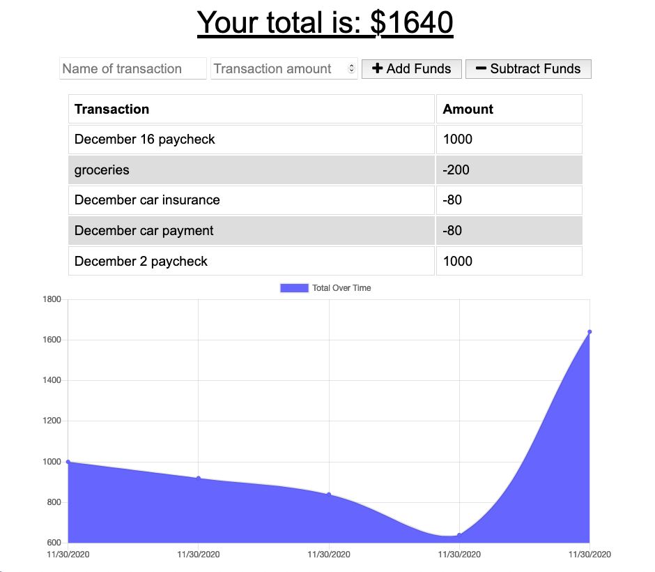

# Budget Tracker
<hr>

[](https://github.com/theykay)
[](https://choosealicense.com/licenses/mit/)

## Contents
* [Links](#links)
* [Demo](#demo)
* [Description](#description)
* [Technologies](#technologies)
* [Contact](#contact)
* [](#)

## Links
Deployed site (hosted on Heroku): [Budget Tracker](https://secure-cliffs-06418.herokuapp.com/)\
Github Repository: [budger](https://github.com/theykay/budger)

## Demo


## Description
Budget Tracker that functions both online and offline

## Technologies
* ```node.js```
* ```Mongodb```
* ```Mongoose```
* ```IndexedDB```
* ```Chart.js```
* ```HTML5```
* ```JavaScript```
* ```CSS3```

## Contact
Github: [theykay](https://github.com/theykay)\
Email: [murraykyleb@gmail.com](mailto:murraykyleb@gmail.com)

## License
Project covered under the [MIT](https://choosealicense.com/licenses/mit/)